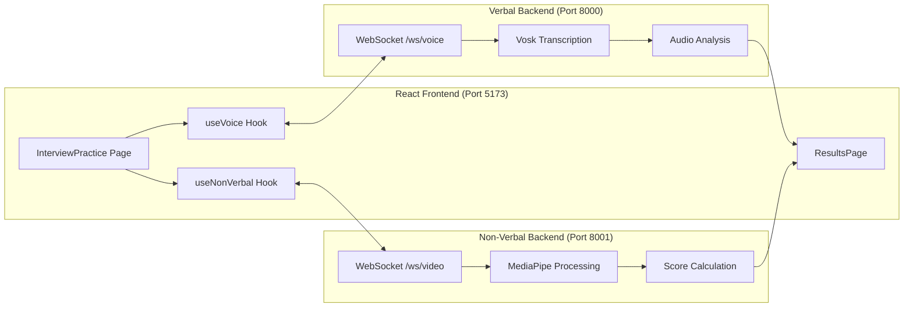

# 🔍 Complete Project Analysis Report

**Generated:** 2026-02-06  
**Project:** InterviewAI - AI-Powered Interview Practice Platform

---

## 📁 Project Structure Overview

```
hackathon/
├── .gitignore                    # Git ignore rules
├── app/                          # React Frontend (81 files)
│   ├── src/
│   │   ├── App.tsx               # Main app with routing & auth context
│   │   ├── main.tsx              # Entry point with ErrorBoundary
│   │   ├── index.css             # Global styles
│   │   ├── App.css               # App-specific styles
│   │   ├── components/ui/        # 53 UI components (shadcn/ui)
│   │   ├── hooks/
│   │   │   ├── useVoice.ts       # WebSocket hook for speech transcription
│   │   │   ├── useNonVerbal.ts   # WebSocket hook for video analysis
│   │   │   └── use-mobile.ts     # Mobile detection hook
│   │   ├── lib/
│   │   │   ├── supabase.ts       # Supabase client with fallback
│   │   │   └── utils.ts          # Utility functions
│   │   └── pages/
│   │       ├── LandingPage.tsx   # Marketing landing page (696 lines)
│   │       ├── LoginPage.tsx     # Authentication page
│   │       ├── Dashboard.tsx     # Main dashboard (434 lines)
│   │       ├── InterviewPractice.tsx  # Interview session (515 lines)
│   │       ├── ResultsPage.tsx   # Results display (466 lines)
│   │       ├── ProfilePage.tsx   # User profile
│   │       └── StatisticsPage.tsx # Analytics page
│   ├── .env                      # Environment variables (PLACEHOLDER)
│   ├── package.json              # Dependencies
│   ├── vite.config.ts            # Vite configuration
│   ├── tailwind.config.js        # Tailwind CSS config
│   └── tsconfig.json             # TypeScript config
│
├── interview_speech_module/      # Verbal Analysis Backend (Port 8000)
│   ├── app.py                    # FastAPI server
│   ├── speech_utils.py           # Audio processing utilities
│   ├── requirements.txt          # Python dependencies
│   ├── test_vosk.py              # Testing script
│   └── vosk-model-small-en-us-0.15/  # Vosk model files
│
└── non verbal module/            # Non-Verbal Analysis Backend (Port 8001)
    ├── app.py                    # FastAPI server
    ├── run_demo.py               # Demo script
    ├── requirements.txt          # Python dependencies
    └── src/non_verbal_analysis/
        ├── __init__.py
        ├── analyzer.py           # Main orchestrator (340 lines)
        ├── pipeline.py           # Processing pipeline (429 lines)
        ├── eye_contact_analyzer.py
        ├── session_manager.py
        ├── models.py             # Data models
        ├── validators.py         # Input validation
        ├── integrity_enforcer.py # Single-face enforcement
        └── utils.py              # Helper functions
```

---

## 🛠 Technology Stack

### Frontend (`app/`)
| Technology | Version | Purpose |
|------------|---------|---------|
| React | 19.2.0 | UI Framework |
| Vite | 7.2.4 | Build tool |
| TypeScript | 5.9.3 | Type safety |
| TailwindCSS | 3.4.19 | Styling |
| React Router | 7.13.0 | Navigation |
| Supabase | 2.94.1 | Auth & Database |
| Recharts | 2.15.4 | Analytics charts |
| Radix UI | Various | Accessible components |
| Lucide React | 0.562.0 | Icons |

### Verbal Backend (`interview_speech_module/`)
| Technology | Purpose |
|------------|---------|
| FastAPI | Web framework |
| Vosk | Offline speech recognition |
| Librosa | Audio feature extraction |
| Parselmouth (Praat) | Pitch analysis |
| WebSocket | Real-time streaming |

### Non-Verbal Backend (`non verbal module/`)
| Technology | Purpose |
|------------|---------|
| FastAPI | Web framework |
| MediaPipe | Face/pose detection |
| OpenCV | Image processing |
| WebSocket | Real-time video streaming |

---

## 🔄 Data Flow Architecture



---

## ✅ Compilation & Syntax Check Results

| Check | Status | Details |
|-------|--------|---------|
| TypeScript Compilation | ✅ PASS | No errors in `app/` |
| Python (speech module) | ✅ PASS | `app.py`, `speech_utils.py` valid |
| Python (non-verbal module) | ✅ PASS | All module files valid |

---

## ⚠️ Issues & Warnings Found

### 🔴 Critical Issues

#### 1. Supabase Environment Variables Not Configured
**Location:** `app/.env`
```env
VITE_SUPABASE_URL=your-supabase-project-url
VITE_SUPABASE_ANON_KEY=your-supabase-anon-key
```
**Impact:** Authentication will not work. App falls back to placeholder client.
**Fix:** Replace with actual Supabase credentials.

---

### 🟡 Warnings

#### 2. Non-Verbal Module Missing FastAPI/Uvicorn in requirements.txt
**Location:** `non verbal module/requirements.txt`
```
mediapipe
opencv-python
numpy
pydantic
```
**Missing:** `fastapi`, `uvicorn` (required by `app.py`)
**Fix:** Add to requirements.txt:
```
fastapi
uvicorn
```

---

#### 3. Unused Import in ResultsPage.tsx
**Location:** `app/src/pages/ResultsPage.tsx`, Line 6
```tsx
import { Eye, User, Activity } from 'lucide-react';
```
**Impact:** These icons are imported but not used in the component.
**Fix:** Remove unused imports to reduce bundle size.

---

#### 4. Minor JSX Formatting (Cosmetic)
**Location:** `app/src/pages/ResultsPage.tsx`, Lines 422, 463
```tsx
</main >   // Extra space before >
</div >    // Extra space before >
```
**Impact:** No functional issue, purely cosmetic.
**Fix:** Remove extra spaces.

---

#### 5. Hardcoded WebSocket URLs
**Locations:**
- `app/src/hooks/useVoice.ts` Line 79: `ws://localhost:8000/ws/voice/`
- `app/src/hooks/useNonVerbal.ts` Line 77: `ws://localhost:8001/ws/video/`
- `app/src/hooks/useNonVerbal.ts` Line 151: `http://localhost:8001/analyze_session/`

**Impact:** Won't work in production without URL change.
**Fix:** Use environment variables:
```tsx
const WS_URL = import.meta.env.VITE_VERBAL_WS_URL || 'ws://localhost:8000';
```

---

#### 6. Session Data Stored In-Memory Only
**Locations:**
- `interview_speech_module/app.py` Line 20: `sessions = {}`
- `non verbal module/app.py` Line 33: `sessions = {}`

**Impact:** All session data lost on server restart.
**Fix:** Consider Redis or database persistence for production.

---

#### 7. Deprecated ScriptProcessorNode Usage
**Location:** `app/src/hooks/useVoice.ts` Line 95
```tsx
const processor = audioContext.createScriptProcessor(BUFFER_SIZE, 1, 1);
```
**Impact:** `ScriptProcessorNode` is deprecated in favor of `AudioWorkletNode`.
**Note:** Still works but may be removed in future browser versions.

---

### 🟢 Good Practices Found

| Practice | Location | Description |
|----------|----------|-------------|
| Error Boundary | `main.tsx` | Catches React runtime errors |
| Auth Timeout | `App.tsx` | 3-second failsafe for Supabase |
| Supabase Fallback | `lib/supabase.ts` | Graceful handling of missing credentials |
| CORS Configuration | Both backends | Properly allows frontend origins |
| Modular Pipeline | `non_verbal_analysis/` | Clean separation of concerns |
| Type Safety | Throughout | Good TypeScript usage |

---

## 📊 Code Statistics

### Frontend Files
| File | Lines | Size |
|------|-------|------|
| LandingPage.tsx | 696 | 28.8 KB |
| InterviewPractice.tsx | 515 | 19.3 KB |
| ResultsPage.tsx | 466 | 18.4 KB |
| Dashboard.tsx | 434 | 18.1 KB |
| StatisticsPage.tsx | 434 | 16.6 KB |
| ProfilePage.tsx | ~400 | 14.9 KB |
| LoginPage.tsx | ~350 | 13.6 KB |

### Backend Files
| Module | File | Lines | Size |
|--------|------|-------|------|
| Verbal | app.py | 122 | 3.7 KB |
| Verbal | speech_utils.py | 65 | 2.0 KB |
| Non-Verbal | app.py | 171 | 5.9 KB |
| Non-Verbal | analyzer.py | 340 | 12.1 KB |
| Non-Verbal | pipeline.py | 429 | 15.0 KB |

### UI Components
- **Total:** 53 components in `components/ui/`
- **Largest:** sidebar.tsx (22.4 KB)
- **Framework:** shadcn/ui (Radix-based)

---

## 🚀 How to Run the Project

### 1. Frontend
```bash
cd app
npm install
npm run dev
# Runs on http://localhost:5173
```

### 2. Verbal Analysis Backend
```bash
cd interview_speech_module
pip install -r requirements.txt
python app.py
# Runs on http://localhost:8000
```

### 3. Non-Verbal Analysis Backend
```bash
cd "non verbal module"
pip install -r requirements.txt
pip install fastapi uvicorn  # Missing from requirements.txt
python app.py
# Runs on http://localhost:8001
```

---

## 📝 Summary

| Category | Count |
|----------|-------|
| Total Directories | 10+ |
| Frontend Source Files | 68 |
| Backend Python Files | 13 |
| UI Components | 53 |
| Critical Issues | 1 |
| Warnings | 6 |
| Total Code Lines | ~4,000+ |

**Overall Status:** ✅ Project compiles successfully with minor issues to address before production.
